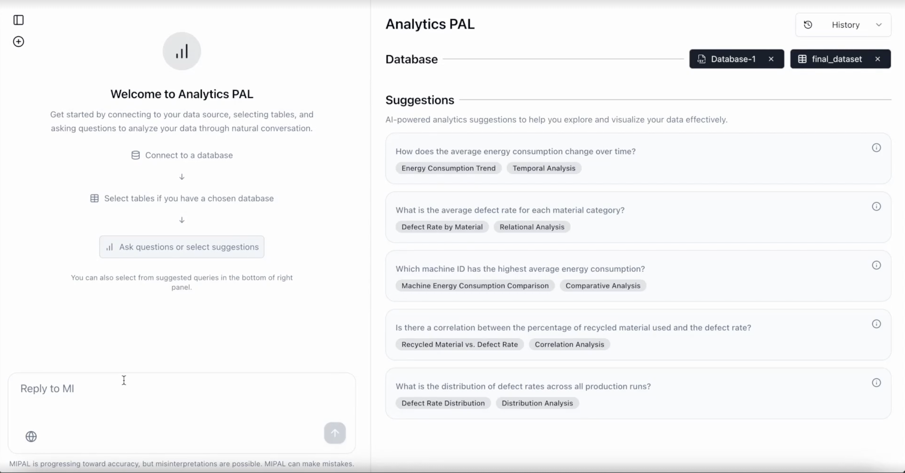
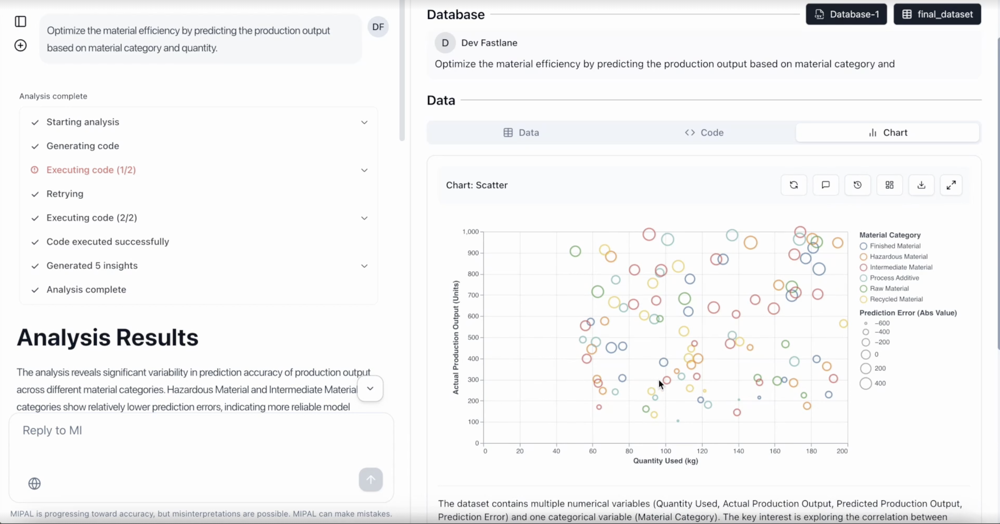

# Mipal Analytics

This repository contains both the backend and frontend components of the Mipal Analytics platform.

## 🖼️ UI Screenshots

### Chat Overview



### Analytics Interface



### Dashboard Graph Interface


## Project Structure

```
mipal-analytics/
├── backend/          # Backend API and services
│   ├── app/          # Main application code
│   ├── cmd_server/   # Server and worker commands
│   ├── pkg/          # Shared packages
│   ├── conf/         # Configuration files
│   ├── docker/       # Docker configurations
│   ├── docs/         # Backend documentation
│   └── ...           # Other backend files
├── frontend/         # Frontend application (to be added)
└── README.md         # This file
```

## Backend

The backend is a Python-based API service built with FastAPI. It provides:

- User authentication and authorization
- Analytics and chart generation
- Chat functionality with LLM integration
- Code execution capabilities
- Integration with various data sources

For detailed backend documentation, see [backend/README.md](backend/README.md).

## Frontend

The frontend is a modern React-based application built with Next.js, TypeScript, and Tailwind CSS. It provides:

- User interface for analytics and chart generation
- Chat interface with LLM integration
- Database integration management
- Responsive design for all devices
- Internationalization support

For detailed frontend documentation and setup instructions, see [frontend/README.md](frontend/README.md).

## Getting Started

### Backend Development

```bash
cd backend
# Follow the setup instructions in backend/README.md
```

### Frontend Development

```bash
cd frontend
# Follow the setup instructions in frontend/README.md
npm install
npm run dev
```

The frontend will be available at [http://localhost:3000](http://localhost:3000).

## Contributing

We welcome contributions! Please read our [Contributing Guidelines](CONTRIBUTING.md) for details on:

- Code of conduct
- Development setup
- Pull request process
- Coding standards
- Testing guidelines

For module-specific information:

- [Backend Contributing](backend/README.md)
- [Frontend Contributing](frontend/README.md)

## License

This project is licensed under the Apache License 2.0 - see the [LICENSE](LICENSE) file for details.

## Copyright

Copyright 2024 Fastlane Developers
